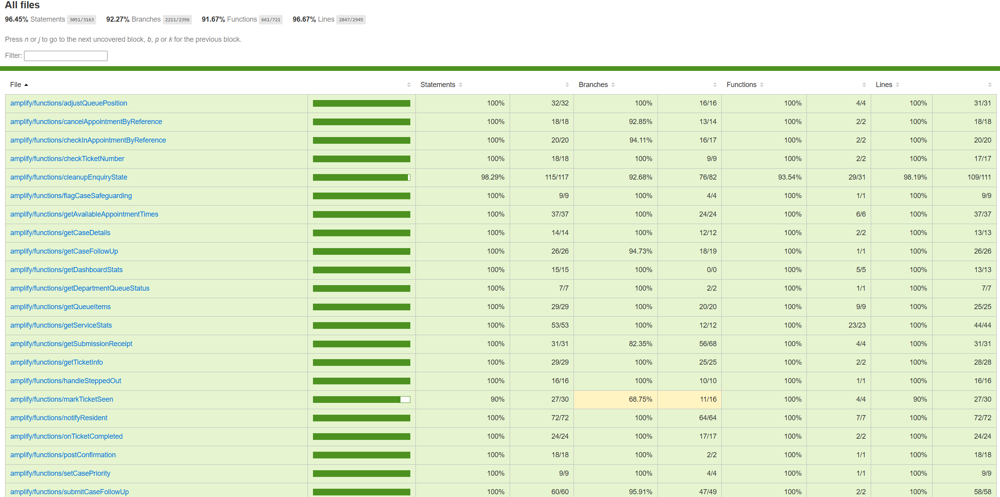
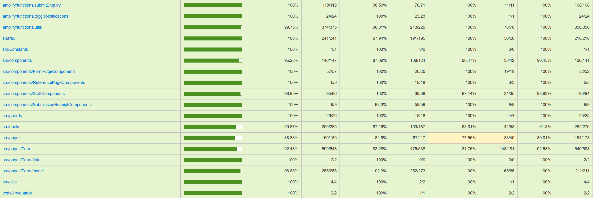

# ResidentsPath

This README provides the main repository guide, including access instructions, file information, authorship, testing information, and links to related project documents.

## Access and Installation

### Live Demo

- [ResidentsPath live demo](https://www.residentspath.uk)

### Local Setup

Prerequisites:

- Node.js 20.19 or newer
- `npm`
- AWS access if you want to run the Amplify backend locally

Install and run:

```bash
npm install
npx ampx sandbox
npx ampx sandbox seed
npm run dev
```

Notes:

- `npx ampx sandbox` provisions or updates the Amplify sandbox backend and generates `amplify_outputs.json`.
- `npx ampx sandbox seed` seeds the department data used by the prototype within the sandbox.
- On the production demo deployment, seeded tickets are created every day at midnight UTC.
- The frontend expects `amplify_outputs.json` to exist when the app starts.

### Deployed Demo Staff Accounts

The deployed version already includes pre-created staff accounts:

- `StaffAccount1@residentspath.com`
- `StaffAccount2@residentspath.com`
- `StaffAccount3@residentspath.com`

Password for all three staff accounts: `Testaccount123*`

### Cognito Group Setup For Local Deployments

Newly registered users are added to the `Residents` Cognito group automatically. To use staff-only features or Hounslow House device-only features, users must be placed in the correct Cognito group manually through the Cognito Console.


- `Staff` is required for the protected staff pages, including the staff dashboard, queue management, and case management. Staff users also have the ability to check-in appointments and can create an unlimited number of additional appointments for a case.
- `HounslowHouseDevices` is required for accounts which simulate the behaviour of devices at Hounslow House, which would be able to check-in appointments from the reference page.


To set this up in the Cognito Console:

1. Open AWS Cognito and go to the user pool for this deployment.
2. Open `User management` and then `Users`.
3. Select the user account that should act as a staff member or shared device account.
4. Add it to the `Staff` or `HounslowHouseDevices` group as needed.
5. If the user was already signed in when the group was assigned, you may need to sign out and sign back in so the updated group membership appears in the token claims.

Note:

For local sandbox setups, the generated `amplify_outputs.json` file contains the Cognito user pool ID under `auth.user_pool_id`.

## Testing

### How to Run Tests

Run the full test suite with:

```bash
npm test
```

This runs:

```bash
vitest run --coverage
```

Examples of targeted runs:

```bash
npx vitest run tests/src/pages/Form/FormEntry.test.tsx
npx vitest run tests/amplify/functions/submitEnquiry.test.ts
```

### Coverage Summary

Latest recorded coverage summary:





If coverage is generated locally, the full HTML report can be opened from [coverage/index.html](coverage/index.html).

### Automated Testing Rationale

The testing approach focused mainly on unit testing non-trivial frontend behaviour, shared validation rules, and backend behaviour, including edge cases where necessary. The aim was to achieve high coverage wherever practical, with only very small or trivial logic left untested.

## Help and Support

This prototype does not include a user manual. Instead, guidance is built into the interface so users are told what to do as they move through the main journeys:

- The resident form is divided into clear steps, with navigation controls and page content that explain what information is being requested.
- Inline validation and error messages tell users when required information is missing or when a submission step has failed.
- `SubmissionReceipt` provides a record of the submitted ticket, case, or appointment reference and explains how these details can be used later on the `ReferencePage`.
- The staff dashboard, queue page, and case-management views label the main controls directly so staff can move between overview, queue, and case records without separate instructions.
- Staff actions that change queue order or case state use visible action buttons and confirmation prompts so the effect of each control is clearer before it is applied.

## Related Documents

- `CHANGELOG.md` contains the separate major milestones and version timeline, including where feedback was implemented into the design.

## Incomplete Implementation

- Translation support is not available across all pages. In particular, the resident form is only partially translated.
- Text-to-speech support is only available in English.
- Mobile UI support is only implemented for the resident form. The reference page, dashboards, and staff workflows all require a desktop or laptop to use.
- Staff accounts cannot sign up through the prototype and must be created or assigned through the AWS Cognito Console.

## Authors

The table below summarises the main contribution areas associated with each contributor.

| Author | Main contribution areas |
| --- | --- |
| Jacob Whiting | Resident form, submission logic, shared form schema, follow-up submissions, appointment booking and appointment reference backend, and related testing |
| Hasnain Naqvi | Backend setup, data schema, authentication, notifications, backend integration, and related testing |
| Naomi Quartsin | Reference page frontend, QR scanning, ticket and reference lookup, and related testing |
| Romina Hosseinkhani | User dashboard, translations, nav bar, text-to-speech functionality, and related testing |
| Abu-Bakarr Jalloh | Staff dashboard, queue management, case views, staff queue actions, and related testing |

## Repository Structure and File Inventory

The tables below cover files included in the repository. Generated files created during install, build, or sandbox provisioning are not listed.

#### Root, Configuration, and Static Files

| Path | Information |
| --- | --- |
| `README.md` | Main repository guide |
| `CHANGELOG.md` | Development timeline and feedback-driven change record |
| `LICENSE` | Licence for the submitted code |
| `.gitignore` | Git ignore rules |
| `package.json` | Root package manifest and scripts |
| `package-lock.json` | Root dependency lockfile |
| `tsconfig.json` | Base TypeScript configuration |
| `tsconfig.app.json` | Frontend TypeScript configuration |
| `tsconfig.node.json` | Node and tooling TypeScript configuration |
| `vite.config.ts` | Vite build and test configuration |
| `eslint.config.js` | ESLint configuration |
| `.github/workflows/ci.yml` | GitHub Actions workflow for running the project checks in continuous integration |
| `amplify.yml` | Amplify deployment configuration |
| `index.html` | Vite application HTML entry point |
| `public/vite.svg` | Default Vite static asset |
| `public/locales/en/default.json` | English localisation strings |
| `public/locales/cy/default.json` | Welsh localisation strings |
| `public/locales/fa/default.json` | Persian localisation strings |
| `public/locales/pa/default.json` | Punjabi localisation strings |
| `public/locales/pl/default.json` | Polish localisation strings |

#### Shared Files

| Path | Information |
| --- | --- |
| `shared/formSchema.ts` | Shared form validation and submission rules |
| `shared/referenceNumbers.ts` | Shared reference-number generation and parsing logic |
| `shared/departmentCodes.ts` | Shared department code definitions |

#### Frontend Setup, Theme, Layout, and Utility Files

| Path | Information |
| --- | --- |
| `src/main.tsx` | Frontend bootstrap and Amplify configuration |
| `src/routes.tsx` | Main application routes |
| `src/i18n.js` | Frontend localisation setup |
| `src/Constants/AmplifyTheme.tsx` | Amplify UI theme customisation |
| `src/Constants/Theme.tsx` | Main Material UI theme |
| `src/layouts/StaffLayout.tsx` | Shared staff-page layout |
| `src/utils/getDataAuthMode.ts` | Helper for choosing Amplify data auth mode |
| `src/assets/react.svg` | Default React static asset |

#### Frontend Component Files

##### `src/components`

| Path | Information |
| --- | --- |
| `src/components/BookingPanel.tsx` | Appointment selection and availability component |
| `src/components/ContactDetailsDialog.tsx` | Contact-details dialog component |
| `src/components/LanguageSupportButton.tsx` | Language support button component |
| `src/components/LoadingSpinner.tsx` | Shared loading indicator component |
| `src/components/NavBar.tsx` | Main navigation bar |
| `src/components/TextToSpeechButton.tsx` | Text-to-speech trigger component |

##### `src/components/FormPageComponents`

| Path | Information |
| --- | --- |
| `src/components/FormPageComponents/FormPrivacyNotice.tsx` | Form privacy notice component |
| `src/components/FormPageComponents/FormStepLayout.tsx` | Shared form step layout |
| `src/components/FormPageComponents/LeftCheckRow.tsx` | Left-aligned check row for form summaries |
| `src/components/FormPageComponents/LongTextSection.tsx` | Long text display component for form pages |
| `src/components/FormPageComponents/OptionTile.tsx` | Selectable tile component for form options |
| `src/components/FormPageComponents/outlinedInfoAlertSx.ts` | Shared form alert styling helper |
| `src/components/FormPageComponents/PrivacyNoticeDialog.tsx` | Privacy notice dialog |
| `src/components/FormPageComponents/RequireFormSteps.tsx` | Step-completion guard component for form flow |
| `src/components/FormPageComponents/ResumeFromSave.tsx` | Saved-draft resume component |
| `src/components/FormPageComponents/StepActions.tsx` | Navigation controls for form steps |
| `src/components/FormPageComponents/WithTTS.tsx` | Wrapper for text-to-speech support in form content |

##### `src/components/ReferencePageComponents`

| Path | Information |
| --- | --- |
| `src/components/ReferencePageComponents/AppointmentOptionsDialog.tsx` | Dialog for appointment actions from the reference page |
| `src/components/ReferencePageComponents/ScanButton.tsx` | QR scan trigger on the reference page |

##### `src/components/StaffComponents`

| Path | Information |
| --- | --- |
| `src/components/StaffComponents/CaseItemCard.tsx` | Staff case summary card |
| `src/components/StaffComponents/ConfirmChangeModal.tsx` | Confirmation modal for staff actions |
| `src/components/StaffComponents/CurrentQueueItem.tsx` | Staff queue item card with actions |
| `src/components/StaffComponents/DetailRow.tsx` | Shared row for labelled staff details |
| `src/components/StaffComponents/QueueRow.tsx` | Queue-summary table row component |
| `src/components/StaffComponents/SectionCard.tsx` | Staff dashboard section card |
| `src/components/StaffComponents/StaffNavItem.tsx` | Item in the staff navigation |
| `src/components/StaffComponents/StaffNavbar.tsx` | Staff navigation bar |
| `src/components/StaffComponents/StatCard.tsx` | Staff statistics card |

##### `src/components/SubmissionReceiptComponents`

| Path | Information |
| --- | --- |
| `src/components/SubmissionReceiptComponents/ReceiptBody.tsx` | Main body of the submission receipt |
| `src/components/SubmissionReceiptComponents/ReceiptDetailsCard.tsx` | Receipt details card |
| `src/components/SubmissionReceiptComponents/ReceiptHeaderCard.tsx` | Receipt header card |
| `src/components/SubmissionReceiptComponents/ReceiptQrCard.tsx` | Receipt QR-code card |

#### Frontend Page, Context, Hook, Guard, and Form Model Files

##### `src/pages`

| Path | Information |
| --- | --- |
| `src/pages/AccessDenied.tsx` | Displays the fallback screen for users who reach a route they are not allowed to access |
| `src/pages/AuthPage.tsx` | Handles resident and staff sign-in and routes users into the correct flow |
| `src/pages/CheckInConfirmation.tsx` | Shows the confirmation state after an appointment has been checked in successfully |
| `src/pages/LandingPage.tsx` | Provides the main entry point into the prototype and directs residents to the next step |
| `src/pages/ReferencePage.tsx` | Lets users enter or scan references to look up queue and appointment information |
| `src/pages/StaffCaseDetails.tsx` | Shows the full details for an individual case and supports staff updates |
| `src/pages/StaffCaseManagementPage.tsx` | Lists staff cases and provides navigation into individual case records |
| `src/pages/StaffDashboard.tsx` | Shows headline staff metrics and entry points into the staff pages |
| `src/pages/StaffQueuePage.tsx` | Displays the live queue and lets staff reorder, prioritise, flag, and complete queue items |
| `src/pages/UserDashboard.tsx` | Shows a resident's current queue or appointment status, wait information, and notification settings |

##### `src/pages/Form`

| Path | Information |
| --- | --- |
| `src/pages/Form/Actions.tsx` | Shows queue information and, when applicable, the embedded appointment-booking panel for the resident's selected next step |
| `src/pages/Form/EnquirySelection.tsx` | Collects the resident's enquiry and routes them into the appropriate branch of the form |
| `src/pages/Form/ExistingCaseFollowUp.tsx` | Collects a follow-up submission for residents who already have an existing case |
| `src/pages/Form/FormEntry.tsx` | Determines how the resident enters the form flow, including new and follow-up journeys |
| `src/pages/Form/FormLayout.tsx` | Provides shared structure, navigation, and styling across the multi-step form |
| `src/pages/Form/PersonalDetails.tsx` | Collects personal, contact, and support information needed for the submission |
| `src/pages/Form/ReviewAndSubmit.tsx` | Presents completed answers for review and triggers final submission to the backend |
| `src/pages/Form/SubmissionReceipt.tsx` | Displays the resulting case, ticket, or appointment reference details after submission |

##### `src/pages/Form/data`

| Path | Information |
| --- | --- |
| `src/pages/Form/data/enquiries.ts` | Enquiry definitions used in the form |
| `src/pages/Form/data/languages.ts` | Language options used in the form |

##### `src/pages/Form/model`

| Path | Information |
| --- | --- |
| `src/pages/Form/model/buildSubmitEnquiryPayload.ts` | Form data to submission-payload mapping |
| `src/pages/Form/model/draftStorage.ts` | Form draft persistence logic |
| `src/pages/Form/model/enquirySelectionLogic.ts` | Enquiry selection branching logic |
| `src/pages/Form/model/fieldMeta.ts` | Metadata for form fields |
| `src/pages/Form/model/formFieldTypes.ts` | Type definitions for form state |
| `src/pages/Form/model/getEnquirySelectionState.ts` | Derived state for enquiry selection |
| `src/pages/Form/model/initialState.ts` | Initial form state values |

##### `src/context`

| Path | Information |
| --- | --- |
| `src/context/FormWizardProvider.tsx` | Stores form state, controls step progression, and manages draft resume behaviour |

##### `src/hooks`

| Path | Information |
| --- | --- |
| `src/hooks/useAppointmentReferenceActions.ts` | Wraps the check-in and cancellation actions available from an appointment reference |
| `src/hooks/useAuth.ts` | Exposes the current authentication state and sign-in related helpers |
| `src/hooks/useCaseDetails.ts` | Fetches and subscribes to the data needed for the staff case-details view |
| `src/hooks/useCases.ts` | Fetches and shapes the data shown in the staff case-management list |
| `src/hooks/useCheckReferenceNumber.ts` | Validates a reference number and loads the matching ticket or appointment details |
| `src/hooks/useDashboardStats.ts` | Loads the summary metrics displayed on the staff dashboard |
| `src/hooks/useQueueItems.ts` | Fetches and refreshes the live queue items used in the staff queue view |
| `src/hooks/useServiceStats.ts` | Loads per-service statistics used in staff reporting views |
| `src/hooks/useTicketQueueInfo.ts` | Loads a resident's current queue position and estimated wait details |
| `src/hooks/useUser.ts` | Loads the current user's stored profile and preference data |

##### `src/guards`

| Path | Information |
| --- | --- |
| `src/guards/RequireAuth.tsx` | Authenticated-route guard |
| `src/guards/RequireGuest.tsx` | Guest-only route guard |
| `src/guards/RequireRole.tsx` | Role-based route guard |

#### Amplify Backend Files

##### `amplify`

| Path | Information |
| --- | --- |
| `amplify/README.md` | Amplify-specific documentation |
| `amplify/package.json` | Amplify package manifest |
| `amplify/tsconfig.json` | Amplify TypeScript configuration |
| `amplify/backend.ts` | Main Amplify backend definition |
| `amplify/auth/resource.ts` | Authentication resource configuration |
| `amplify/data/resource.ts` | Amplify data schema |
| `amplify/i18n/amplifyTranslations.ts` | Amplify UI translation customisation |
| `amplify/seed/seed.ts` | Seed script for backend data |

##### `amplify/functions`

| Path | Information |
| --- | --- |
| `amplify/functions/adjustQueuePosition/handler.ts` | Reorders waiting tickets within a department queue and persists the updated positions |
| `amplify/functions/adjustQueuePosition/resource.ts` | Amplify resource definition for queue-position adjustment |
| `amplify/functions/cancelAppointmentByReference/handler.ts` | Cancels an appointment when a valid appointment reference is supplied from the reference flow |
| `amplify/functions/cancelAppointmentByReference/resource.ts` | Amplify resource definition for appointment cancellation by reference |
| `amplify/functions/checkInAppointmentByReference/handler.ts` | Marks an appointment as checked in using the appointment reference entered or scanned by the user |
| `amplify/functions/checkInAppointmentByReference/resource.ts` | Amplify resource definition for appointment check-in by reference |
| `amplify/functions/checkTicketNumber/handler.ts` | Checks whether a resident-facing ticket number exists and is valid for the current day |
| `amplify/functions/checkTicketNumber/resource.ts` | Amplify resource definition for ticket-number validation |
| `amplify/functions/cleanupEnquiryState/handler.ts` | Releases reserved state after failed or abandoned submissions so references, slots, and queue positions are not left stuck |
| `amplify/functions/cleanupEnquiryState/helpers.ts` | Shared helper logic used by the enquiry-state cleanup flow |
| `amplify/functions/cleanupEnquiryState/resource.ts` | Amplify resource definition for enquiry-state cleanup |
| `amplify/functions/dailySeedQueue/handler.ts` | Seeds fresh queue data for the start of a new day in development or demo environments |
| `amplify/functions/dailySeedQueue/resource.ts` | Amplify resource definition for daily queue seeding |
| `amplify/functions/flagCaseSafeguarding/handler.ts` | Updates the safeguarding flag used by staff to mark cases that may present a risk |
| `amplify/functions/flagCaseSafeguarding/resource.ts` | Amplify resource definition for safeguarding flag updates |
| `amplify/functions/getAvailableAppointmentTimes/handler.ts` | Returns bookable appointment slots for the chosen service and date |
| `amplify/functions/getAvailableAppointmentTimes/resource.ts` | Amplify resource definition for appointment-time lookup |
| `amplify/functions/getCaseDetails/handler.ts` | Loads the full case record and related detail needed for the staff case-details page |
| `amplify/functions/getCaseDetails/resource.ts` | Amplify resource definition for case-detail retrieval |
| `amplify/functions/getCaseFollowUp/handler.ts` | Loads the data needed to start a follow-up submission against an existing case |
| `amplify/functions/getCaseFollowUp/resource.ts` | Amplify resource definition for existing-case follow-up retrieval |
| `amplify/functions/getDashboardStats/handler.ts` | Calculates the summary metrics shown on the staff dashboard |
| `amplify/functions/getDashboardStats/resource.ts` | Amplify resource definition for dashboard statistics |
| `amplify/functions/getDepartmentQueueStatus/handler.ts` | Returns current queue size and timing information for the selected department |
| `amplify/functions/getDepartmentQueueStatus/resource.ts` | Amplify resource definition for department queue status |
| `amplify/functions/getQueueItems/handler.ts` | Loads the live queue items displayed in the staff queue-management view |
| `amplify/functions/getQueueItems/resource.ts` | Amplify resource definition for queue-item retrieval |
| `amplify/functions/getServiceStats/handler.ts` | Calculates service-level statistics used in the staff views |
| `amplify/functions/getServiceStats/resource.ts` | Amplify resource definition for service statistics |
| `amplify/functions/getSubmissionReceipt/handler.ts` | Builds the submission receipt returned after a resident completes a form |
| `amplify/functions/getSubmissionReceipt/resource.ts` | Amplify resource definition for submission receipt retrieval |
| `amplify/functions/getTicketInfo/handler.ts` | Returns the latest queue status information for a valid ticket reference |
| `amplify/functions/getTicketInfo/resource.ts` | Amplify resource definition for ticket information retrieval |
| `amplify/functions/handleSteppedOut/handler.ts` | Updates the stepped-out state when a resident temporarily leaves or rejoins the queue |
| `amplify/functions/handleSteppedOut/resource.ts` | Amplify resource definition for stepped-out handling |
| `amplify/functions/hello/handler.ts` | Example Lambda retained from setup and not part of the main prototype workflow |
| `amplify/functions/hello/resource.ts` | Amplify resource definition for the example Lambda |
| `amplify/functions/markTicketSeen/handler.ts` | Marks a queue item as completed once staff have seen the resident |
| `amplify/functions/markTicketSeen/resource.ts` | Amplify resource definition for marking tickets as seen |
| `amplify/functions/notifyResident/handler.ts` | Sends notifications to residents about queue progress and related updates |
| `amplify/functions/notifyResident/resource.ts` | Amplify resource definition for resident notifications |
| `amplify/functions/onTicketCompleted/handler.ts` | Runs follow-up processing after a ticket is completed, including queue recalculation hooks |
| `amplify/functions/onTicketCompleted/resource.ts` | Amplify resource definition for ticket-completion processing |
| `amplify/functions/postConfirmation/handler.ts` | Creates or updates the application user record after Cognito sign-up confirmation |
| `amplify/functions/postConfirmation/resource.ts` | Amplify resource definition for post-confirmation user setup |
| `amplify/functions/setCasePriority/handler.ts` | Updates whether a case should be treated as priority in staff workflows |
| `amplify/functions/setCasePriority/resource.ts` | Amplify resource definition for case-priority updates |
| `amplify/functions/submitCaseFollowUp/handler.ts` | Creates a follow-up submission against an existing case, including any related ticket or appointment changes |
| `amplify/functions/submitCaseFollowUp/resource.ts` | Amplify resource definition for follow-up submissions |
| `amplify/functions/submitEnquiry/handler.ts` | Processes a new resident submission and creates the resulting case, ticket, or appointment records |
| `amplify/functions/submitEnquiry/resource.ts` | Amplify resource definition for enquiry submissions |
| `amplify/functions/toggleNotifications/handler.ts` | Updates a resident's notification preferences from the dashboard flow |
| `amplify/functions/toggleNotifications/resource.ts` | Amplify resource definition for notification preference changes |

##### `amplify/functions/utils`

| Path | Information |
| --- | --- |
| `amplify/functions/utils/amplifyClient.ts` | Shared helper for creating Amplify data clients inside backend functions |
| `amplify/functions/utils/caseAccess.ts` | Shared rules for checking whether a user can access a case |
| `amplify/functions/utils/cognitoClient.ts` | Shared helper for creating the Cognito client used by backend functions |
| `amplify/functions/utils/endUserMessagingClient.ts` | Shared helper for sending end-user messages through the configured messaging service |
| `amplify/functions/utils/enquiriesStateTable.ts` | Shared helpers for reserving and releasing transient submission state during form processing |
| `amplify/functions/utils/getAppointmentReferenceDetails.ts` | Shared logic for resolving appointment details from a supplied reference |
| `amplify/functions/utils/identityGroups.ts` | Shared helpers for interpreting user identity groups and roles |
| `amplify/functions/utils/queueWaitTimes.ts` | Shared logic for estimating and formatting queue wait times |
| `amplify/functions/utils/recalculateDepartmentQueue.ts` | Shared logic for recalculating queue positions and wait estimates within a department |
| `amplify/functions/utils/runCleanup.ts` | Shared wrapper for running cleanup routines safely after failures |
| `amplify/functions/utils/sesClient.ts` | Shared helper for creating the SES client used for outbound email |
| `amplify/functions/utils/submissionShared.ts` | Shared submission logic reused by the new-submission and follow-up handlers |

#### Frontend Test Files

##### `tests`

| Path | Information |
| --- | --- |
| `tests/tsconfig.json` | TypeScript configuration for the test suite |
| `tests/setup/setup.frontend.ts` | Shared Vitest and Testing Library setup for frontend tests |
| `tests/shared/formSchema.test.ts` | Tests for the shared form schema |
| `tests/shared/referenceNumbers.test.ts` | Tests for shared reference-number logic |

##### `tests/src/components`

| Path | Information |
| --- | --- |
| `tests/src/components/BookingPanel.test.tsx` | Tests for the booking panel |
| `tests/src/components/LanguageSupportButton.test.tsx` | Tests for the language support button |
| `tests/src/components/TextToSpeechButton.test.tsx` | Tests for the text-to-speech button |

##### `tests/src/components/FormPageComponents`

| Path | Information |
| --- | --- |
| `tests/src/components/FormPageComponents/FormPrivacyNotice.test.tsx` | Tests for the form privacy notice |
| `tests/src/components/FormPageComponents/RequireFormSteps.test.tsx` | Tests for required form-step behaviour |
| `tests/src/components/FormPageComponents/ResumeFromSave.test.tsx` | Tests for resuming a saved draft |

##### `tests/src/components/ReferencePageComponents`

| Path | Information |
| --- | --- |
| `tests/src/components/ReferencePageComponents/AppointmentOptionsDialog.test.tsx` | Tests for the appointment options dialog on the reference page |
| `tests/src/components/ReferencePageComponents/ScanButton.test.tsx` | Tests for the scan button |

##### `tests/src/components/StaffComponents`

| Path | Information |
| --- | --- |
| `tests/src/components/StaffComponents/CaseItemCard.test.tsx` | Tests for the staff case item card |
| `tests/src/components/StaffComponents/ConfirmChangeModal.test.tsx` | Tests for the staff confirmation modal |
| `tests/src/components/StaffComponents/CurrentQueueItem.test.tsx` | Tests for the current queue item component |
| `tests/src/components/StaffComponents/QueueRow.test.tsx` | Tests for the queue row component |
| `tests/src/components/StaffComponents/SectionCard.test.tsx` | Tests for the staff section card |
| `tests/src/components/StaffComponents/StaffNavItem.test.tsx` | Tests for the staff navigation item |
| `tests/src/components/StaffComponents/StaffNavbar.test.tsx` | Tests for the staff navigation bar |
| `tests/src/components/StaffComponents/StatCard.test.tsx` | Tests for the staff statistics card |

##### `tests/src/components/SubmissionReceiptComponents`

| Path | Information |
| --- | --- |
| `tests/src/components/SubmissionReceiptComponents/ReceiptBody.test.tsx` | Tests for the receipt body component |
| `tests/src/components/SubmissionReceiptComponents/ReceiptDetailsCard.test.tsx` | Tests for the receipt details card |
| `tests/src/components/SubmissionReceiptComponents/ReceiptHeaderCard.test.tsx` | Tests for the receipt header card |
| `tests/src/components/SubmissionReceiptComponents/ReceiptQrCard.test.tsx` | Tests for the receipt QR card |

##### `tests/src/guards`

| Path | Information |
| --- | --- |
| `tests/src/guards/helpers.ts` | Test helpers for route-guard tests |
| `tests/src/guards/RequireAuth.test.tsx` | Tests for the authenticated-route guard |
| `tests/src/guards/RequireGuest.test.tsx` | Tests for the guest-route guard |
| `tests/src/guards/RequireRole.test.tsx` | Tests for the role-route guard |

##### `tests/src/hooks`

| Path | Information |
| --- | --- |
| `tests/src/hooks/useAppointmentReferenceActions.test.tsx` | Tests for the appointment reference actions hook |
| `tests/src/hooks/useAuth.test.ts` | Tests for the auth hook |
| `tests/src/hooks/useCaseDetails.test.ts` | Tests for the case-details hook |
| `tests/src/hooks/useCheckReferenceNumber.test.tsx` | Tests for reference-number checking |
| `tests/src/hooks/useDashboardStats.test.ts` | Tests for the dashboard stats hook |
| `tests/src/hooks/useQueueItems.test.tsx` | Tests for the queue-items hook |
| `tests/src/hooks/useServiceStats.test.ts` | Tests for the service-stats hook |

##### `tests/src/utils`

| Path | Information |
| --- | --- |
| `tests/src/utils/getDataAuthMode.test.ts` | Tests for data auth mode selection |

##### `tests/src/pages`

| Path | Information |
| --- | --- |
| `tests/src/pages/ReferencePage.test.tsx` | Tests for the reference page |
| `tests/src/pages/UserDashboard.test.tsx` | Tests for the resident dashboard |

##### `tests/src/pages/Form`

| Path | Information |
| --- | --- |
| `tests/src/pages/Form/Actions.test.tsx` | Tests for the actions form step |
| `tests/src/pages/Form/EnquirySelection.test.tsx` | Tests for the enquiry selection page |
| `tests/src/pages/Form/ExistingCaseFollowUp.test.tsx` | Tests for the existing-case follow-up page |
| `tests/src/pages/Form/FormEntry.test.tsx` | Tests for the form entry page |
| `tests/src/pages/Form/PersonalDetails.test.tsx` | Tests for the personal-details page |
| `tests/src/pages/Form/ReviewAndSubmit.test.tsx` | Tests for the review and submit page |
| `tests/src/pages/Form/SubmissionReceipt.test.tsx` | Tests for the submission receipt page |

##### `tests/src/pages/Form/model`

| Path | Information |
| --- | --- |
| `tests/src/pages/Form/model/buildSubmitEnquiryPayload.test.ts` | Tests for form submission payload building |
| `tests/src/pages/Form/model/draftStorage.test.ts` | Tests for draft-storage behaviour |
| `tests/src/pages/Form/model/enquirySelectionLogic.test.ts` | Tests for enquiry selection logic |
| `tests/src/pages/Form/model/fieldMeta.test.ts` | Tests for form field metadata |
| `tests/src/pages/Form/model/getEnquirySelectionState.test.ts` | Tests for derived enquiry selection state |

#### Backend Test Files

##### `tests/amplify/functions`

| Path | Information |
| --- | --- |
| `tests/amplify/functions/adjustQueuePosition.test.ts` | Tests for queue-position adjustment |
| `tests/amplify/functions/cancelAppointmentByReference.test.ts` | Tests for appointment cancellation by reference |
| `tests/amplify/functions/checkInAppointmentByReference.test.ts` | Tests for appointment check-in by reference |
| `tests/amplify/functions/checkTicketNumber.test.ts` | Tests for ticket-number checking |
| `tests/amplify/functions/cleanupEnquiryState/cleanupEnquiryState-helpers.test.ts` | Tests for enquiry-state cleanup helpers |
| `tests/amplify/functions/cleanupEnquiryState/cleanupEnquiryState.test.ts` | Tests for enquiry-state cleanup flow |
| `tests/amplify/functions/flagCaseSafeguarding.test.ts` | Tests for safeguarding flag updates |
| `tests/amplify/functions/getAvailableAppointmentTimes.test.ts` | Tests for appointment-time lookup |
| `tests/amplify/functions/getCaseDetails.test.ts` | Tests for case-detail retrieval |
| `tests/amplify/functions/getCaseFollowUp.test.ts` | Tests for existing-case follow-up retrieval |
| `tests/amplify/functions/getDashboardStats.test.ts` | Tests for dashboard statistics retrieval |
| `tests/amplify/functions/getDepartmentQueueStatus.test.ts` | Tests for department queue status retrieval |
| `tests/amplify/functions/getQueueItems.test.ts` | Tests for queue-item retrieval |
| `tests/amplify/functions/getServiceStats.test.ts` | Tests for service statistics retrieval |
| `tests/amplify/functions/getSubmissionReceipt.test.ts` | Tests for submission receipt retrieval |
| `tests/amplify/functions/getTicketInfo.test.ts` | Tests for ticket information retrieval |
| `tests/amplify/functions/handleSteppedOut.test.ts` | Tests for stepped-out handling |
| `tests/amplify/functions/markTicketSeen.test.ts` | Tests for marking tickets as seen |
| `tests/amplify/functions/notifyResident.test.ts` | Tests for resident notifications |
| `tests/amplify/functions/onTicketCompleted.test.ts` | Tests for ticket-completion follow-up |
| `tests/amplify/functions/postConfirmation.test.ts` | Tests for post-confirmation user setup |
| `tests/amplify/functions/setCasePriority.test.ts` | Tests for case-priority updates |
| `tests/amplify/functions/submitCaseFollowUp.test.ts` | Tests for follow-up submission handling |
| `tests/amplify/functions/submitEnquiry.test.ts` | Tests for enquiry submission handling |
| `tests/amplify/functions/toggleNotifications.test.ts` | Tests for notification preference toggling |

##### `tests/amplify/utils`

| Path | Information |
| --- | --- |
| `tests/amplify/utils/caseAccess.test.ts` | Tests for case-access utilities |
| `tests/amplify/utils/enquiriesStateTable.test.ts` | Tests for enquiry-state table utilities |
| `tests/amplify/utils/getAppointmentReferenceDetails.test.ts` | Tests for appointment-reference helper logic |
| `tests/amplify/utils/identityGroups.test.ts` | Tests for identity-group utilities |
| `tests/amplify/utils/recalculateDepartmentQueue.test.ts` | Tests for queue recalculation logic |
| `tests/amplify/utils/runCleanup.test.ts` | Tests for cleanup helper execution |
| `tests/amplify/utils/submissionShared.test.ts` | Tests for shared submission utilities |
